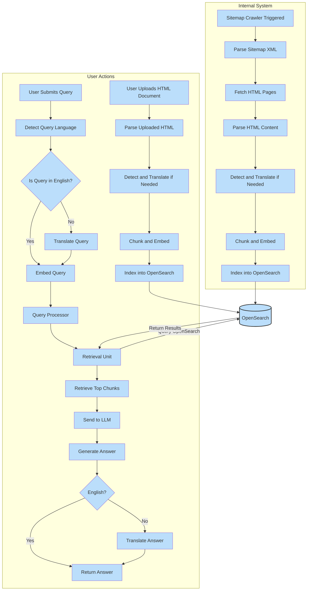
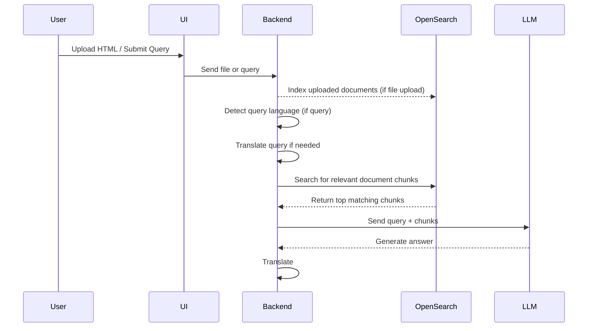
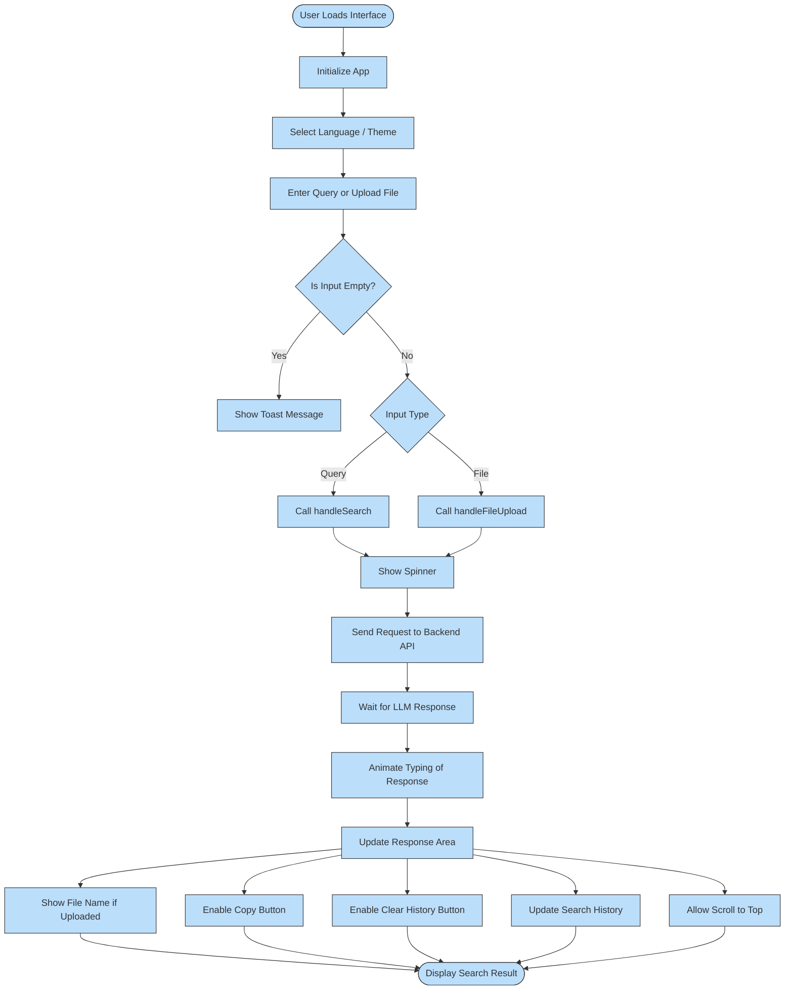
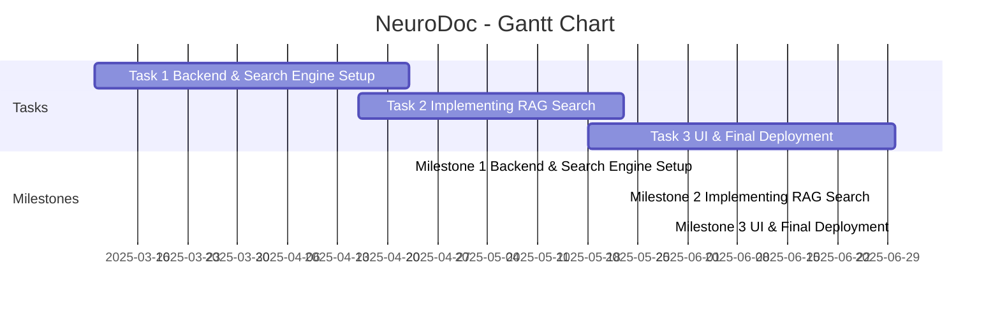

# NeuroDoc - Intelligent Search Engine for Documents

## Project Evaluation

### Introduction
NeuroDoc is an intelligent search engine designed to enhance document retrieval by leveraging **Retrieval-Augmented Generation (RAG)** and **LLM (Large Language Models)**. The system processes unstructured text data, retrieves relevant documents, and generates intelligent responses, improving information access in enterprise settings. Developed in cooperation with **Neurosoft Sp. z o.o.**, the project integrates **Django** for backend development and **OpenSearch** for efficient document indexing.
### State-of-the-Art Overview
Current search engines rely on either traditional keyword-based retrieval or AI-driven models. Standard search systems use **TF-IDF** or **BM25**, while modern AI solutions incorporate **vector embeddings** for semantic search. NeuroDoc aims to **combine these approaches** using RAG, enhancing search accuracy by providing **contextually relevant** responses instead of just retrieving documents. Existing solutions like ChatGPT plugins and hybrid search systems lack real-time adaptability for enterprise document search.


## System Workflow  

### Query Processing Flow (Multilingual & RAG Search)



The following diagram illustrates the **query processing workflow** in NeuroDoc:  




## Solution

### Idea of the Solution
## Solution

### Idea of the Solution

**NeuroDoc** integrates **OpenSearch** with a **Django-based backend** to build a robust and scalable intelligent search system. The system consists of:

- **Backend (Django)**
  - Implements the API for document upload and indexing.
  - Processes user input, retrieves documents, and passes data to the LLM.
  - Utilizes the **RAG method** to generate AI-enhanced responses.

- **Search Engine (OpenSearch)**
  - Indexes and retrieves documents efficiently.
  - Supports both **keyword-based** and **vector-based** search.
  - Uses **BM25** (default in OpenSearch) for traditional retrieval and **SentenceTransformer-based embeddings** for semantic matching.
  - saves recent user search

- **Frontend (React)**
  - Provides an interactive UI for users to input queries and receive search results.
  - Displays retrieved documents and AI-generated summaries.

---

### Details of the Solution

The system follows a **three-step process**:

### Details of the Solution

The system follows a **three-step process**:

1. **Indexing Phase**  
   - Uploaded HTML documents or crawled web pages are parsed.
   - Language is detected and content is translated if needed.
   - Documents are chunked into small pieces.
   - Each chunk is embedded into a dense vector using **SentenceTransformer** models.
   - Chunks and metadata (e.g., file name, language) are indexed into **OpenSearch** for efficient retrieval.

2. **Retrieval Phase**  
   - When a user submits a query, the system first detects the query language.
   - If the query is not in English, it is translated into English.
   - The query is embedded into a vector.
   - The embedded query is used to search **OpenSearch**, retrieving the top relevant document chunks based on semantic similarity.

3. **Response Generation Phase (RAG)**  
   - Retrieved document chunks and the user's query are sent together to the **LLM** (e.g., DeepSeek or OpenAI).
   - The LLM generates a grounded answer based on the retrieved context.
   - If needed, the generated answer is translated back into the user's original language.
   - The final answer is returned to the frontend and displayed to the user.

## solutions found

### Matio Hashul – Backend

#### 1. [DeepSeek Integration with RAG](https://opensearch.org/blog/deepseek-integration-rag/?utm_source=chatgpt.com)
- DeepSeek integrates seamlessly with the RAG (Retrieval-Augmented Generation) method, offering enhanced capabilities in document retrieval and response generation.
- It facilitates efficient and scalable indexing, enabling the system to handle large datasets.
- This integration provides a significant performance boost, enhancing search speed and relevance.
- I’m utilizing DeepSeek in the backend to optimize the retrieval process and integrate with our LLMs for generating contextual responses.

---

#### 2. [RAG Techniques GitHub Repository](https://github.com/NirDiamant/RAG_Techniques/tree/main)
- This repository contains various RAG techniques and their implementations for enhancing retrieval-based generation systems.
- It includes detailed code examples, best practices, and optimization tips for implementing RAG with LLMs.
- I’ve explored this repository to understand different approaches and optimize our backend's response generation pipeline.

---

#### 3. 💡 YouTube Inspiration
Some of the backend ideas and implementations were inspired by tutorials and examples found on YouTube:
- [RAG and LLM Integration](https://www.youtube.com/watch?v=t-uAgI-AUxc): This video provided a detailed walkthrough of RAG implementation, which I leveraged to enhance the backend logic in our system.

---
 


### Dominik Koprowski - OpenSearch

#### 1. [OpenSearch Documentation](https://opensearch.org/docs/latest/about/)
- Open-source search and analytics engine. Essential for integrating OpenSearch into the backend.


#### 2. [AWS OpenSearch Service Tutorial](https://docs.aws.amazon.com/pdfs/opensearch-service/latest/developerguide/opensearch-service-dg.pdf#tutorials)
- Step-by-step guide for setting up OpenSearch on AWS, including indexing and configuring data.


#### 3. [RAG with OpenSearch & Amazon Bedrock](https://github.com/aws-samples/rag-using-langchain-amazon-bedrock-and-opensearch/blob/main/README.md)
- Shows how to use OpenSearch with LangChain and Amazon Bedrock for building a RAG pipeline.


#### 4. **OpenSearch Integration Steps**

 **Install and Configure**  
   - Set up OpenSearch locally or on AWS, configure indexing and permissions.  
   - Resources: [OpenSearch Docs](https://opensearch.org/docs/latest/about/).

 **Create Indexes & Data Structure**  
   - Design schema and optimize indexing.  
   - Resources: [Indexing Guide](https://opensearch.org/docs/latest/index/).

 **CRUD Operations & Search**  
   - Use OpenSearch REST API for CRUD operations and configure full-text search.  
   - Resources: [OpenSearch API](https://opensearch.org/docs/latest/clients/).

 **Integrate with RAG**  
   - Retrieve documents using semantic vectors for LLM context.  
   - Resources: [RAG Setup](https://github.com/aws-samples/rag-using-langchain-amazon-bedrock-and-opensearch/blob/main/README.md).

 **Optimization**  
   - Scale the system to handle large datasets with efficient query processing.  
   - Resources: [Scaling Tips](https://opensearch.org/docs/latest/advanced/).


#### 5. 💡 **YouTube Inspiration**  
- [Intro to OpenSearch](https://www.youtube.com/watch?v=SIl5PM4m2KM)  
- [OpenSearch on AWS](https://www.youtube.com/watch?v=BNOYTbRbaFQ&pp=ygUaQVdTIE9wZW5TZWFyY2ggcXVpY2sgc3RhcnQ%3D)

---


### Abdullah Hamad - Frontend

#### 1. [chat-ui-kit-react/src/components](https://github.com/chatscope/chat-ui-kit-react/tree/master/src/components)
- a full-featured chat UI built with **React + .jsx files** and **plain CSS**
- includes chat bubbles, avatars, layout structure
- no dark mode or i18n, but it’s clean and easy to extend
- i’m using this as a base to grab components and ideas, and then building things the way i want


#### 2. [Sohaib-2/react-js-shadcn-starter](https://github.com/Sohaib-2/react-js-shadcn-starter)
- a modern React starter with built-in **dark mode** and **i18n**
- uses **Tailwind CSS + shadcn/ui** for the UI components
- i’m not using Tailwind now, but might in the future — so this is useful for reference
- mainly using it for inspiration on structure and features


#### 3. 💡 YouTube Inspiration
some of the ideas and styling were also inspired by tutorials and examples found on YouTube:
- [React Full Course for free ⚛ (2024)](https://www.youtube.com/watch?v=CgkZ7MvWUAA&t=203s)
- [Tailwind CSS in React for Beginners](https://www.youtube.com/watch?v=1WdL1TLfkYo)


## Picked Solution 

### Backend Development (Matio)
As a start I will be using this page [DeepSeek Integration with RAG](https://opensearch.org/blog/deepseek-integration-rag/?utm_source=chatgpt.com) as a reference to creat my backend, then I will integrate Django and start adding a function to support my needs, after that the plan is to improve the RAG using some of the techniques listed in this page [RAG Techniques GitHub Repository](https://github.com/NirDiamant/RAG_Techniques/tree/main).

## Backend Workflow

The backend workflow in **NeuroDoc** supports three main processing paths, each triggered by a specific type of action. These are:

1. **Case 1: Search Query Submission**
2. **Case 2: HTML Document Upload**
3. **Case 3: Automated Sitemap Crawling**

Each path flows through dedicated modules within the Django backend and contributes to enriching or querying the document knowledge base.

### Case 1: user submits query

When a user submits a search query, the **Search & Retrieval Module** detects the query language, translates it if needed, embeds the query, and retrieves the most relevant chunks from **OpenSearch** using hybrid search. These chunks are passed to the **LLM Integration Module**, which generates a context-aware answer. If necessary, the answer is translated back before being returned to the frontend.


```plaintext
╔════════════════════════════════════════════════════════════════════════╗
║                        CASE 1: User Submits Query                      ║
╚════════════════════════════════════════════════════════════════════════╝

┌───────────────────────┐
│   User Interface      │
│    (React Frontend)   │
└──────────┬────────────┘
           │ (GET /api/search/?query=...)
           ▼
┌──────────────────────────────────────┐
│ Django Backend (DRF Server Layer)    │
│ - API routing (urls.py)              │
│ - Request validation (serializers.py)│
│ - CORS handling (settings.py)        │
└──────────┬───────────────────────────┘
           ▼
┌──────────────────────────────────────┐
│ Search & Retrieval Module            │
│ (search/views.py)                    │
│ - search_query()                     │
│ - detect_language()                  │
│ - translate_query() (if needed)      │
└──────────┬───────────────────────────┘
           ▼
┌─────────────────────────────┐
│ Embedding Module            │
│ (embedding.py)              │
│ - generate_embeddings()     │
└──────────┬──────────────────┘
           ▼
┌─────────────────────────────┐
│ OpenSearch Database         │
│ - Hybrid search             │
│ - Return top chunks         │
└──────────┬──────────────────┘
           ▼
┌──────────────────────────────┐
│ LLM Integration Module       │
│ (llm_integration.py)         │
│ - generate_response()        │
│ - translate_answer()         │
└──────────┬───────────────────┘
           ▼
┌──────────────────────────────┐
│ Return Response to Frontend  │
└──────────────────────────────┘


```

### Case 2: user uploads HTML document

When a user uploads an HTML document, the **Upload & Indexing Module** extracts and processes the text, detects the language, translates if required, and generates embeddings through the **Embedding Module**. The content and metadata are then indexed into **OpenSearch** for future queries.

```plaintext
╔════════════════════════════════════════════════════════════════════════╗
║                    CASE 2: User Uploads HTML Document                  ║
╚════════════════════════════════════════════════════════════════════════╝

┌───────────────────────┐
│   User Interface      │
│    (React Frontend)   │
└──────────┬────────────┘
           │ (POST /api/upload/)
           ▼
┌──────────────────────────────────────┐
│ Django Backend (DRF Server Layer)    │
│ - API routing (urls.py)              │
│ - Request validation (serializers.py)│
│ - CORS handling (settings.py)        │
└──────────┬───────────────────────────┘
           ▼
┌──────────────────────────────────────┐
│ Upload & Indexing Module             │
│ (upload_and_index.py)                │
│ - extract_text_from_file()           │
│ - detect_language()                  │
│ - translate_text() (if needed)       │
└──────────┬───────────────────────────┘
           ▼
┌─────────────────────────────┐
│ Embedding Module            │
│ (embedding.py)              │
│ - generate_embeddings()     │
└──────────┬──────────────────┘
           ▼
┌─────────────────────────────┐
│ OpenSearch Database         │
│ - Store vectors & metadata  │
└─────────────────────────────┘

```

### Case 3: Sitemap Crawler Triggered

In the case of the automated sitemap crawler, the system parses a given sitemap XML, downloads the linked HTML pages, and processes them in the same way as user-uploaded documents. This scheduled or triggered backend task allows NeuroDoc to continuously ingest external documentation without user intervention.

```plaintext
╔════════════════════════════════════════════════════════════════════════╗
║                   CASE 3: Sitemap Crawler Triggered                    ║
╚════════════════════════════════════════════════════════════════════════╝

┌──────────────────────────────┐
│ Trigger (Button or Scheduler)│
└──────────┬───────────────────┘
           ▼
┌──────────────────────────────────────┐
│ Django Backend (DRF Server Layer)    │
│ - API routing (urls.py)              │
│ - Request validation (serializers.py)│
└──────────┬───────────────────────────┘
           ▼
┌──────────────────────────────────────┐
│ Sitemap Crawler Module               │
│ (crawl_sitemap.py)                   │
│ - parse_sitemap()                    │
│ - download_and_index_url()           │
└──────────┬───────────────────────────┘
           ▼
┌──────────────────────────────────────┐
│ Upload & Indexing Module             │
│ (upload_and_index.py)                │
│ - extract_text_from_file()           │
│ - detect_language()                  │
│ - translate_text() (if needed)       │
└──────────┬───────────────────────────┘
           ▼
┌─────────────────────────────┐
│ Embedding Module            │
│ (embedding.py)              │
│ - generate_embeddings()     │
└──────────┬──────────────────┘
           ▼
┌─────────────────────────────┐
│ OpenSearch Database         │
│ - Store vectors & metadata  │
└─────────────────────────────┘
```

# 🧩 Module Overview: Files, Functions, and Descriptions

| Module | Files/Classes/Functions Inside | Description |
|:-------|:-------------------------------|:------------|
| **Django Backend Server** | `urls.py`, `serializers.py`, `settings.py` | Main API server layer. Handles request routing, validation, CORS, and DRF configuration. |
| **Upload & Indexing Module** | `upload_and_index.py` <br> — `extract_text_from_file()` <br> — `detect_language()` <br> — `index_document()` | Handles file uploads: parses content, detects language, calls embedding module, and indexes data into OpenSearch. |
| **Sitemap Crawler Module** | `crawl_sitemap.py` <br> — `parse_sitemap()` <br> — `download_and_index_url()` | Parses sitemap XMLs, downloads HTML pages, and reuses Upload & Indexing Module to process and index content. |
| **Embedding Module** | `embedding.py` <br> — `generate_embeddings()` | Generates dense vector embeddings for documents and queries using SentenceTransformer models. |
| **Search & Retrieval Module** | `search/views.py` <br> — `search_query()` <br> — `retrieve_top_chunks()` <br> *(with the possibility to extract retrieval logic into `retrieval.py` for cleaner separation)* | Handles user queries: detects query language, translates if needed, generates embeddings, performs hybrid search, and prepares context for LLM. |
| **LLM Integration Module** | `llm_integration.py` <br> — `generate_response()` | Combines query and document context to generate final answer using DeepSeek (or other LLMs). Optionally translates response. |
| **Database (OpenSearch)** | (External) OpenSearch indices | Stores document chunks, embeddings, and metadata. Supports keyword and semantic search. |
| **CORS Handling** | `django-cors-headers` (configured in `settings.py`) | Enables secure cross-origin requests between React frontend and Django backend. |


## Backend–Frontend Communication

The NeuroDoc system follows a **client-server architecture** where the **React frontend** communicates with the **Django REST backend** over HTTP.  
All interactions between the frontend and backend are handled through clearly defined **RESTful APIs**.


## 📤 Communication Flow

- **Frontend (React)** collects user actions such as:
  - Uploading documents (HTML files)
  - Entering search queries

- **Frontend sends corresponding HTTP requests** to the Django backend API:
  - **File uploads:** `POST /api/upload/`
  - **Query searches:** `GET /api/search/?query=...`

- **Sitemap crawling** is handled entirely by the backend:
  - It can be triggered manually (via admin or CLI)
  - Or scheduled as a background task 
  - It fetches and processes HTML pages listed in a given sitemap XML

- **Backend (Django DRF)** processes incoming requests by:
  - Parsing and validating data using `serializers.py`
  - Routing through view functions defined in `views.py`
  - Managing cross-origin access with **django-cors-headers** to allow safe communication from the React frontend

- **Backend modules perform the appropriate tasks:**
  - Extract and preprocess text
  - Detect language and translate if needed
  - Generate semantic embeddings via `sentence-transformers`
  - Store content and metadata into **OpenSearch**
  - Retrieve relevant chunks and generate answers via **DeepSeek LLM**

- **Backend returns JSON responses** to the frontend:
  - Status messages (success or error) for uploads
  - AI-generated answers for search queries

- **Frontend dynamically updates** the UI based on backend responses:
  - Displaying upload results, search outcomes, or generated answers

---

# 🔗 API Endpoints Overview

| Endpoint               | Method | Purpose                                                       |
|:-----------------------|:-------|:--------------------------------------------------------------|
| `/api/upload/`         | POST   | Upload and index an HTML document file                        |
| `/api/crawl-sitemap/`  | POST   | Backend endpoint to crawl a sitemap and index linked pages    |
| `/api/search/`         | GET    | Search documents and generate an AI-based answer              |

---

# ⚙️ Key Communication Technologies

| Component                    | Technology                                                                 |
|:-----------------------------|:----------------------------------------------------------------------------|
| **API Format**               | RESTful APIs built with Django REST Framework (DRF)                         |
| **Data Exchange**            | JSON (for search queries and responses), multipart/form-data (for uploads) |
| **Cross-Origin Communication** | Managed via `django-cors-headers` to allow secure React–Django communication |
| **Search and Storage**       | OpenSearch (supports hybrid search: BM25 + vector similarity)              |
| **AI Answer Generation**     | DeepSeek LLM (integrated in backend for context-aware response generation) |

# OpenAPI Specification

```yaml
openapi: 3.0.0
info:
  title: Neurosoft Doc Search API
  version: 1.1.0
  description: RESTful API for uploading HTML documents, crawling sitemap URLs, and retrieving answers through semantic search and LLMs.

paths:
  /api/upload/:
    post:
      summary: Upload and index a document (HTML only)
      requestBody:
        required: true
        content:
          multipart/form-data:
            schema:
              type: object
              properties:
                file:
                  type: string
                  format: binary
                  description: HTML file to be uploaded and indexed
      responses:
        '200':
          description: Document indexed successfully
        '400':
          description: No file provided or invalid format (only .html supported)
        '500':
          description: Internal server error during processing

  /api/crawl-sitemap/:
    post:
      summary: Crawl a sitemap and index linked HTML documents
      description: Triggered by admin or backend process to ingest external HTML content from a sitemap.
      requestBody:
        required: true
        content:
          application/json:
            schema:
              type: object
              properties:
                sitemap_url:
                  type: string
                  example: "http://10.10.54.127/neurodoc/sitemap.xml"
      responses:
        '200':
          description: Sitemap crawled and documents indexed successfully
        '207':
          description: Partial success – some URLs failed to index
        '400':
          description: Invalid or missing sitemap_url
        '500':
          description: Server error during sitemap processing or indexing

  /api/search/:
    get:
      summary: Search indexed documents and generate an AI-based answer
      parameters:
        - name: query
          in: query
          required: true
          schema:
            type: string
            example: "How is ANPR stream processed?"
      responses:
        '200':
          description: AI-generated answer successfully returned
        '400':
          description: Missing or invalid query
        '500':
          description: Search or LLM error occurred

```


## 🛠️ Technologies

| Component         | Technology |
|-------------------|-------------|
| Backend Framework | Django + Django REST Framework (DRF) |
| Search Engine     | OpenSearch (hybrid keyword and vector search) |
| Large Language Model (LLM) | DeepSeek (initially; modular to support OpenAI or others) |
| Embedding Model   | `sentence-transformers` (e.g., MiniLM models) |
| API Communication | RESTful APIs (OpenAPI 3.0 standard) |
| HTML Parsing      | `BeautifulSoup4` |
| Language Detection| `langdetect` |
| OpenSearch Client | `opensearch-py` |
| Transformer Utilities | `transformers` library |

---


### Database Development (Dominik)

#### 1. **Installing OpenSearch in Docker and OpenSearch Dashboards:**

**Configuring OpenSearch to store documents, embeddings, and metadata:**  
- **text:** Document content.  
- **embedding:** Vector representation of the document.  
- **metadata:** Additional information about the document (e.g., title, date).


---


### Frontend Development (abdullah)
i’ve already created a **simple version of the UI** that includes:
- basic layout
- language selector
- theme toggle (light/dark)
- input field with floating label
- response area
- functional buttons (search, clear, copy, etc.)

> it's built with **React** and **plain CSS** using **.jsx files**.

🔗 [Live App](https://neurodoc-ui.vercel.app/)

---
### Abdullah Hamad – Frontend Development (updated)

#### 1. **Connecting the UI to Backend (Query and File Upload)**

To enable the NeuroDoc frontend to interact with the backend, I implemented two main connection functions inside the `App.jsx` file:

- **`handleSearch(query)`**  
    `(const handleSearch = async (query) => {...})`  
  This function is responsible for sending the user's text query to the backend endpoint `/query/`.  
  It performs a `POST` request, waits for the AI-generated answer, and displays it dynamically in the response area with typing animation.  
  It also updates the search history list after each successful query.

- **`handleFileUpload(file)`**  
   `(const handleFileUpload = async (file) => {...})`  
  This function allows users to upload files (PDF, DOCX, TXT, HTML) to the backend endpoint `/upload/`.  
  When a user selects a file, it sends the file without triggering any search.  
  After successful upload, the frontend simply shows the name of the uploaded file, waiting for the user to manually start a search if needed.

Both functions use the native `fetch()` API for HTTP requests, handle loading state (spinner), and handle errors cleanly if the backend is not reachable.

---

#### 2. **Updated the SearchBar Component**

Inside `SearchBar.jsx`, I added a new `onFileUpload` prop to accept the file uploading function from the parent (`App.jsx`).  
When a file is selected, it calls `handleFileUpload(file)` automatically without disturbing the current search input.

This separation ensures a smooth user experience:
- Uploading files does not trigger a search automatically.
- Search is only performed when the user explicitly types and clicks "Search".

---

#### 3. **Enhancements in the Frontend UI**

- **File Upload Status:**  
  After uploading a file, the UI now shows the file name below the search box (e.g., "📄 Uploaded File: document.pdf"), improving user feedback.

- **Loading Indicators:**  
  A spinner is shown while either a file is being uploaded or a query is being processed, enhancing user experience during network operations.

- **Error Handling:**  
  Proper messages are displayed if the backend connection fails during upload or search.

---



#### 💬 Summary of Frontend API Interactions

| Endpoint | Method | Trigger |
|:---|:---|:---|
| `/query/` | POST | When user types a query and clicks Search |
| `/upload/` | POST | When user selects a file to upload |

---

🚀 This frontend part completes the real connection between NeuroDoc UI and backend services, enabling users to search inside uploaded documents dynamically and interactively.

## 🖥️ Frontend Details of the Solution

Below is a deep dive into the **React-based UI** of NeuroDoc, focusing on how the interface works from the user's side — including styling, animation, responsiveness, and multilingual support.

---

### 1. ⚙️ Application Initialization

- **Theme Setup**
  - On app load, we check the current theme (`light` or `dark`) and apply it using:
    ```js
    document.body.className = theme === 'dark' ? 'dark transition' : 'transition';
    ```
  - This affects background and text color by toggling CSS classes.

- **Language Support**
  - The UI supports English, Arabic, and Polish.
  - All dynamic text (button labels, placeholders, etc.) comes from a `translations` object:
    ```js
    const translations = { en: {...}, ar: {...}, pl: {...} };
    ```

---

### 2. 🔍 Search Input & File Upload

- **SearchBar Component**
  - Contains a full-width `<input>` with a floating label.
  - Includes an upload icon (🗂️) that opens a hidden `<input type="file">`.

- **Behavior**
  - Clicking **Search** triggers the query via `onSearch(query)`.
  - Clicking **Clear** resets the input and response via `onClear()`.
  - Uploading a file calls `onFileUpload(file)` and displays the filename under the search bar.

- **Design**
  - Responsive `border-radius: 999px` input.
  - Icon and label styling dynamically adjust based on `lang` direction (RTL or LTR).

---

### 3. ⏳ Spinner & Typing Animation

- **Loading Spinner**
  - Displays a rotating CSS loader while waiting for the backend response.

- **Typing Effect**
  - Response text appears one character at a time using:
    ```js
    setInterval(() => {
      setDisplayedText(prev => prev + response[i]);
    }, 30);
    ```

---

### 4. 🔔 Toast Notifications

- **Empty Search Warning**
  - If a user clicks search with no input, a toast appears:
    ```js
    setToastMessage(t.emptyQuery);
    setShowToast(true);
    setTimeout(() => setShowToast(false), 2000);
    ```

- **Toast Design**
  - Centered at the bottom, auto-dismisses after 2 seconds.

---

### 5. 📜 Search History & 📎 Copy

- **Search History**
  - Stores recent queries in memory and displays them as clickable items.

- **Copy Response**
  - Users can copy the response using:
    ```js
    navigator.clipboard.writeText(response);
    ```

---

### 6. ⬆️ Scroll-to-Top Button

- **FloatingButton Component**
  - Appears at the bottom-right of the screen.
  - Scrolls to the top of the page:
    ```js
    window.scrollTo({ top: 0, behavior: 'smooth' });
    ```

- **Design**
  - Circular, clean UI with hover effects.

---

### 7. 📱 Responsive Layout

- **Mobile-First Design**
  - Components use `flex`, `gap`, and `max-width` to scale smoothly.
  - Media queries handle spacing for smaller devices:
    ```css
    @media (max-width: 600px) {
      .floating-button {
        bottom: 20px;
        right: 20px;
      }
    }
    ```

- **Selector Group**
  - Language and theme dropdowns are wrapped inside `.selector-group` to appear side-by-side or stacked on small screens.

---

### 8. ✅ Summary

The frontend of NeuroDoc is built to be:

- ✅ responsive  
- ✅ multilingual  
- ✅ theme-aware  
- ✅ user-friendly  

It gives a clean and simple interface for users to upload documents or ask questions in any supported language. All logic is modular and easy to extend.


### Code Overview

[in progress]

### Tests and Results

[in progress]

## Conclusions

[in progress]

### Summary

[in progress]

### Possible Enhancements

[in progress]

## Appendices

[in progress]


## 👥 Team Members and Roles:
- **Matio Hashul**: Backend development (Django, RAG).
- **Dominik Koprowski**: backend focused on OpenSearch indexing and retrieval.
- **Abdullah Hamad**: Frontend UI (React).


## Project Milestones

#### Milestone 1: Backend & Search Engine Setup
- **Specific**: Configure Django backend, OpenSearch, and document indexing.
- **Measurable**: Index at least 1000 documents, enable keyword-based search.
- **Time-bound**: Start March 10, 2025, finish by April 23, 2025.
- **Status**: ⏳ In progress

#### Milestone 2: Implementing RAG Search
- **Specific**: Integrate LLM with document retrieval to generate AI-powered responses.
- **Measurable**: Achieve 80% relevance in AI-generated answers.
- **Time-bound**: Start April 16, 2025, finish by May 23, 2025.
- **Status**: ⏳ In progress

#### Milestone 3: UI & Final Deployment
- **Specific**: Develop a frontend interface, deploy as a web application.
- **Measurable**: Complete UI testing, deploy on AWS.
- **Time-bound**: Start May 18, 2025, finish by Jun 30, 2025.
- **Status**: ⏳ In progress

**Deviation**


## Gantt chart


