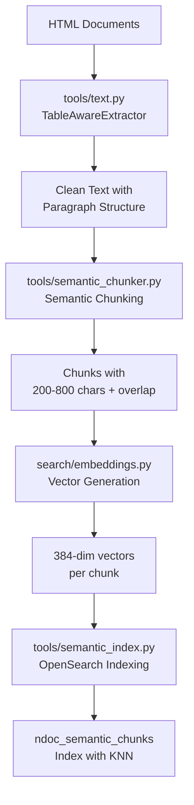
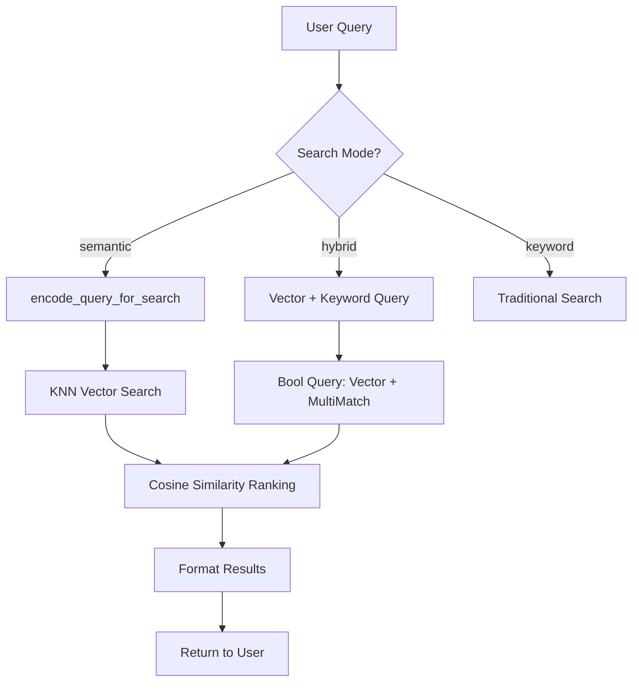

# Simplified Semantic Search

This document describes the streamlined semantic search implementation that leverages the existing tools folder functions to create better chunks and simpler indexing.

## Overview

The semantic search system uses a **hybrid chunking approach** that combines semantic understanding with fixed-size constraints, providing:

- **Better granularity**: Paragraph-aware chunks instead of entire documents
- **Improved relevance**: More precise search results through contextual chunking
- **Simplified architecture**: Less complex code and easier maintenance
- **Reused tools**: Leverages existing `tools/` functions for text processing
- **Smart overlap**: Maintains context between adjacent chunks

## Architecture

### 🛠️ Tools Used

| Tool | Purpose | Key Functions |
|------|---------|---------------|
| `tools/text.py` | HTML→Text extraction | `TableAwareExtractor` - Clean text from HTML |
| `tools/catalog.py` | Document metadata | `extract_title()`, `extract_summary()` |
| `tools/semantic_chunker.py` | **NEW** - Smart chunking | `SemanticChunker.chunk_document()` |
| `tools/semantic_index.py` | **NEW** - Simple indexing | `create_semantic_index()`, `index_chunks()` |

### 🔍 Search Components

| Component | Purpose | Replaces |
|-----------|---------|----------|
| `search/simple_semantic.py` | **NEW** - Clean search interface | `search/semantic_search.py` (deleted) |
| `search/embeddings.py` | Text→Vector conversion | *(kept unchanged)* |
| `search/views.py` | Web interface | *(updated to use new functions)* |

## Document Chunking Strategy

### 📄 **Document Processing Hierarchy**

The system processes documents using a **3-level hierarchy**:

1. **Document Level**: Each document (e.g., "ANPR Camera Setup Guide")
2. **File Level**: Each HTML file within a document (e.g., `position.html`, `parameters.html`)
3. **Chunk Level**: Semantic chunks within each file (preserving paragraph boundaries)

### 🧩 **Chunking Algorithm: Hybrid Semantic + Fixed-Size**

The chunking strategy combines **semantic understanding** with **size constraints**:

#### **Type**: Semantic Chunking with Fixed-Size Boundaries
- **Semantic Component**: Respects paragraph boundaries (`\n\n` splits)
- **Size Component**: 200-800 character limits with 100-character overlap
- **Overlap Strategy**: Word-boundary aware overlap to maintain context

#### **Detailed Algorithm**:

```python
# Configuration
MAX_CHUNK_SIZE = 800    # Maximum characters per chunk
MIN_CHUNK_SIZE = 200    # Minimum characters per chunk  
OVERLAP_SIZE = 100      # Overlap between chunks

# Process:
1. Split text by paragraphs (\n\n)
2. Combine paragraphs into chunks until MAX_CHUNK_SIZE
3. When size limit reached:
   - Finalize current chunk
   - Start new chunk with 100-char overlap from previous chunk
   - Continue with remaining paragraphs
4. Ensure no chunk is smaller than MIN_CHUNK_SIZE
```

#### **Why This Approach?**
- **Preserves meaning**: Doesn't break paragraphs mid-sentence
- **Maintains context**: Overlap ensures continuity between chunks
- **Consistent size**: Fixed boundaries prevent extremely large/small chunks
- **Search-optimized**: Ideal size for vector embeddings and retrieval

## Ingestion Process (Step-by-Step)

### 1. Document Extraction and Chunking

```bash
# Extract and chunk documents using tools functions
python -m tools.semantic_chunker catalog.json input_dir output_dir
```

**Detailed Process:**

#### **Step 1.1: Document Discovery**
- Reads `catalog.json` to discover all documents and languages
- For each document: `ncar-anpr-4-stream-test`, `ncar-anprcam-setup`, etc.
- For each language: `en`, `pl`

#### **Step 1.2: HTML Processing**
- Uses `tools/text.py`'s `TableAwareExtractor` to convert HTML → clean text
- Handles complex HTML: tables, lists, code blocks, navigation
- Extracts document metadata using `tools/catalog.py`: titles, summaries

#### **Step 1.3: File-by-File Chunking**
- Processes each HTML file separately: `index.html`, `position.html`, `test.html`
- Applies semantic chunking algorithm to each file's content
- Creates unique chunk IDs: `{doc_id}::{lang}::{chunk_index}`

#### **Step 1.4: Context Preservation**
Each chunk includes:
```json
{
  "chunk_id": "ncar-anprcam-setup::en::3",
  "doc_id": "ncar-anprcam-setup", 
  "language": "en",
  "file_name": "position.html",
  "doc_title": "ANPR camera configuration",
  "doc_summary": "A procedure for installing and optimally setting up...",
  "content": "The position of the camera should be chosen so that...",
  "content_length": 456,
  "path": "ncar-anprcam-setup/en/position.html"
}
```

### 2. Vector Embeddings and Indexing

```bash
# Create index and generate embeddings
python -m tools.semantic_index chunks.json --all
```

**Detailed Process:**

#### **Step 2.1: Index Creation**
- Creates `ndoc_semantic_chunks` OpenSearch index
- Configures vector field: 384-dimensional vectors (all-MiniLM-L6-v2 model)
- Sets up KNN (K-Nearest Neighbors) for fast similarity search
- Configures language-specific text analyzers

#### **Step 2.2: Embedding Generation**
For each chunk:
```python
# Combine title and content for rich context
text_for_embedding = f"{doc_title} {content}"

# Generate 384-dimensional vector using sentence-transformers
vector = embedding_service.encode_text(text_for_embedding)

# Result: [0.1234, -0.5678, 0.9876, ...] (384 floats)
```

#### **Step 2.3: Bulk Indexing**
- Processes chunks in batches of 100
- Each chunk gets indexed with:
  - **Text fields**: content, doc_title, language, etc.
  - **Vector field**: 384-dimensional embedding
  - **Metadata**: file_name, path, chunk_index

#### **Step 2.4: Index Optimization**
- Enables KNN with HNSW algorithm for fast vector search
- Configures cosine similarity for semantic matching
- Sets up text highlighting for search result display

### 3. Search Interface

The search interface supports three modes:
- **Semantic search**: `?mode=semantic` - Pure vector similarity
- **Hybrid search**: `?mode=hybrid` - Vector + keyword combined  
- **Keyword search**: `?mode=keyword` - Traditional (unchanged)

## Query Processing (What Happens When User Searches)

### 🔍 **User Query Journey**

When a user enters a query like *"What height should I mount the camera?"*, here's the complete process:

#### **Step 1: Query Reception**
```python
# User request
GET /search/?q=What height should I mount the camera&mode=semantic&lang=en
```

#### **Step 2: Query Preprocessing**
- Extract parameters: query, mode, language
- Route to appropriate search function based on mode
- Validate and sanitize input

#### **Step 3A: Semantic Search Path** 
```python
# In search/simple_semantic.py
def search_semantic_chunks(client, query, lang="en"):
    # 1. Convert query to vector
    query_vector = encode_query_for_search(query)
    # Result: [0.2345, -0.1234, 0.8765, ...] (384 dimensions)
    
    # 2. Build KNN search
    search_body = {
        "query": {
            "knn": {
                "content_vector": {
                    "vector": query_vector,
                    "k": 5  # Find 5 nearest neighbors
                }
            }
        }
    }
    
    # 3. Execute vector similarity search
    response = client.search(index="ndoc_semantic_chunks", body=search_body)
```

#### **Step 3B: Hybrid Search Path**
```python
# Combines semantic + keyword for best results
def hybrid_search_chunks(client, query, semantic_weight=0.6):
    search_body = {
        "query": {
            "bool": {
                "should": [
                    # 60% semantic similarity
                    {"knn": {"content_vector": {"vector": query_vector, "boost": 0.6}}},
                    # 40% keyword matching
                    {"multi_match": {"query": query, "fields": ["content", "doc_title"], "boost": 0.4}}
                ]
            }
        }
    }
```

#### **Step 4: Vector Similarity Matching**
OpenSearch performs KNN search:
```
Query Vector:    [0.23, -0.12, 0.87, ...]
                      ↓ Cosine Similarity
Chunk Vectors:   [0.25, -0.11, 0.89, ...] → Score: 0.95 ✅
                 [0.45, -0.67, 0.23, ...] → Score: 0.73 ✅  
                 [0.12, 0.98, -0.34, ...] → Score: 0.45 ❌
```

#### **Step 5: Result Ranking and Filtering** 
- Sort by similarity score (highest first)
- Apply language filter if specified
- Limit to requested number of results (default: 5)

#### **Step 6: Result Formatting**
```python
# For each matching chunk
def format_chunk_hit(hit, query):
    source = hit["_source"]
    
    # Build descriptive title
    title = f"{source['doc_title']} / {source['file_name']}"
    
    # Extract or generate snippet
    if highlight_available:
        snippet = join(highlighted_fragments)
    else:
        snippet = truncate(source["content"], 300)
    
    # Create clickable link
    href = f"/docs/{source['path']}?highlight={query}"
    
    return formatted_result
```

#### **Step 7: Response Assembly**
```json
{
  "results": [
    {
      "title": "ANPR camera configuration / position.html",
      "snippet": "The position of the camera should be chosen so that the movement of the <mark>license plate</mark> can be observed... <mark>height</mark> slightly above the roof...",
      "href": "/docs/ncar-anprcam-setup/en/position.html?highlight=height mount camera",
      "meta": "Language: en | Chunk: 2 | Length: 456 chars",
      "score": 0.95
    }
  ],
  "total": 12,
  "query_time": "23ms"
}
```

### 🎯 **Why This Approach Works**

#### **Semantic Understanding**
- Query: *"camera mounting height"* 
- Matches chunks about: *"position of camera above roof"*, *"installation height"*
- Traditional keyword search might miss these semantic relationships

#### **Context Preservation**
- Each chunk includes document title and summary
- Overlap between chunks ensures no information is lost
- File-level separation maintains document structure

#### **Fast Performance**
- Vector search: ~10-50ms for semantic similarity
- Chunk-based: smaller index than full documents
- Parallel processing: multiple chunks processed simultaneously

## Quick Setup

### Manual Commands (Recommended)

```bash
# 1. Start services
docker-compose up

# 2. Generate catalog 
python3 -m tools.catalog _data _data/catalog.json

# 3. Extract text from HTML
python3 -m tools.text _data/catalog.json _data _text -v 3

# 4. Index documents (keyword search)
python3 -m tools.index _data/catalog.json _data

# 5a. Create semantic chunks
python3 -m tools.semantic_chunker _data/catalog.json _data _data/semantic_chunks

# 5b. Index chunks with vectors
python3 -m tools.semantic_index _data/semantic_chunks/semantic_chunks.json --all

# 6. Start Django server
python3 manage.py runserver
```

### Verification

Check that everything works:
```bash
# Semantic search test
curl "http://localhost:8000/search/?q=camera height mount&mode=semantic"

# Hybrid search test  
curl "http://localhost:8000/search/?q=weather conditions test&mode=hybrid"
```

## Key Improvements

### ✅ **Simplified**
- **3 new files** vs 5+ complex files before
- Clear separation of concerns
- Reuses existing tools functions

### ✅ **Better Chunks**
- **Semantic chunking**: Preserves paragraph boundaries
- **Smart sizing**: 200-800 characters with overlap
- **Context preservation**: Includes document title/summary
- **File-aware**: Processes each HTML file separately

### ✅ **Improved Search**
- **More relevant results**: Chunks vs full documents
- **Better highlighting**: Focuses on relevant sections
- **Cleaner interface**: Simplified response formatting
- **Faster performance**: Smaller index, focused content

## Example Usage

### Search Types

```python
# Pure semantic search
from search.simple_semantic import search_semantic_chunks
results = search_semantic_chunks(client, "neural networks", lang="en")

# Hybrid search (60% semantic, 40% keyword)
from search.simple_semantic import hybrid_search_chunks
results = hybrid_search_chunks(client, "machine learning", semantic_weight=0.6)
```

### Chunk Structure

```json
{
  "chunk_id": "doc123::en::5",
  "doc_id": "doc123",
  "language": "en",
  "file_name": "chapter2.html",
  "chunk_index": 5,
  "doc_title": "Introduction to AI",
  "doc_summary": "Basic concepts...",
  "content": "Neural networks are...",
  "content_length": 456,
  "path": "doc123/en/chapter2.html",
  "content_vector": [0.1, 0.2, ...]
}
```

## Files Changed/Created

### 📁 **New Files**
- `tools/semantic_chunker.py` - Smart document chunking
- `tools/semantic_index.py` - Simplified indexing
- `search/simple_semantic.py` - Clean search interface
- `setup_semantic_search.sh` - One-command setup
- `SEMANTIC_SEARCH.md` - This documentation

### 📁 **Updated Files**
- `search/views.py` - Uses new functions
- `tools/__init__.py` - May need updates for imports

### 📁 **Deleted Files**
- `search/semantic_search.py` - Complex implementation
- `search/management/commands/setup_vector_search.py` - Complex setup

## Chunking Strategy Summary

### 📊 **Chunking Type Analysis**

| Aspect | Implementation | Benefit |
|--------|---------------|---------|
| **Primary Method** | Semantic (paragraph-aware) | Preserves meaning and context |
| **Size Control** | Fixed boundaries (200-800 chars) | Consistent performance |
| **Overlap Strategy** | 100-character word-boundary overlap | Maintains continuity |
| **Hierarchy** | Document → File → Chunk | Structured processing |
| **Context Preservation** | Doc title + summary in each chunk | Rich semantic context |

### 🔄 **Full Ingestion Workflow**



### 🎯 **Query Processing Flow**



## Benefits

### ✅ **Technical Advantages**
1. **Leverages existing tools**: Reuses battle-tested text processing functions
2. **Better search results**: Chunk-based approach provides more relevant matches  
3. **Simpler maintenance**: Less code, clearer structure
4. **Improved performance**: Focused chunks vs large documents
5. **Semantic understanding**: Vector embeddings capture meaning, not just keywords

### ✅ **Search Quality Improvements**
- **Paragraph-aware chunking**: Doesn't break sentences or concepts
- **Context preservation**: Document titles and summaries enrich each chunk
- **Smart overlap**: Ensures no information is lost at chunk boundaries
- **File-level organization**: Maintains document structure hierarchy
- **Multi-modal search**: Semantic, hybrid, and keyword options

### ✅ **Operational Benefits** 
- **Easy setup**: Clear step-by-step process
- **Debug-friendly**: Each step produces inspectable output
- **Scalable**: Chunk-based approach handles large document collections
- **Maintainable**: Simple, focused code modules

## Real-World Example

**Query**: *"What weather conditions should I avoid during ANPR testing?"*

**Traditional Keyword Search**: Might miss relevant content if exact words don't match
**Semantic Chunking Search**: Finds chunks about:
- *"snowfall occurs"* 
- *"ambient air temperature drops below 0° C"*
- *"thunderstorm with hail"*  
- *"dust storm"*

Even though the query uses *"weather conditions"* and content uses *"atmospheric anomaly"*, the semantic vectors understand these are related concepts.

---

*This hybrid semantic chunking approach demonstrates how to combine the best of both worlds: semantic understanding with practical constraints for production search systems.* 